In the optimal-denomination problem, we assumed that the probability of needing to make change for 1 to 99 cents was uniformly distributed. However, we know that this isn't so, because we encounter prices ending in .99 and .50 more often than, for example, .17.

Assuming a uniform distribution, Shallit (2003) argued that the US coinage needed an 18-cent piece. What if we used probabilities based on real-life prices?

For the following analyses, we limit ourselves to denominations comprised of 3 coins, of which there are 4753. In comparison there are 152096 denominations of 4 coins, and 3612280 of 5 coins. At least one coin must have value 1, in order to be able to change all values between 1 and 99, therefore there are really only two degrees of freedom for a 3-coin denomination.

## The solution landscape for the optimal denomination problem

Let's first look at the 'landscape' of solutions under the assumption that all amounts to be changed between 1 and 99 cents are equally likely. Shallit's analysis only reported the best denomination using a given number of coins. However, how much better is the best denomination than the next-best ones? Are there any patterns that we can discern when looking at the change-cost of different denominations?

First we examine the top solutions and see how they compare with each other. We'll use the word 'cost' to refer to the mean fewest-coin solution for all amounts from 1 to 99 for a given denomination.

coin1 | coin2 | coin3 | cost
------|-------|-------|---------
1     | 12    | 19    | 5.202020
1     | 7     | 23    | 5.212121
1     | 8     | 19    | 5.232323
1     | 9     | 22    | 5.232323
1     | 13    | 18    | 5.232323
1     | 11    | 18    | 5.242424

The best denomination, `1 12 19` matches the result of Shallit, although the cost is slightly different because he calculated for values from 1 to 100 but we only do so for 1 to 99. Looking at the top denominations, it is not easy to make out any clear pattern. Instead, we try to visualize the solutions for all denominations.

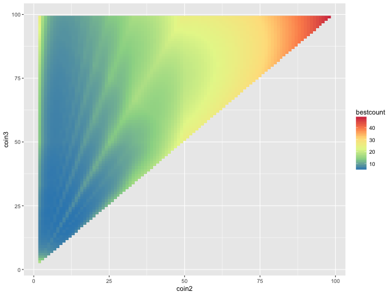

The above plot shows the cost for all possible denominations, depicted by a color scale, with the values of the coins in the denominations represented by the axes of the plot. Warmer colors correspond to higher costs, while cooler colors are lower costs, which are desirable.

It is immediately clear that when a denomination has two coins which are both >50 in value (e.g. `1 60 75`), the cost will be high (upper right of plot). This makes sense, because amounts < 50 will need to be changed in only 1-cent pieces. The very worst denomination is `1 98 99`.

On the right side of the plot are more reasonable denominations. But it is not quite symmetrical. Among the cool blues of low-cost denominations are green streaks representing high-cost denominations. These streaks look suspiciously regular...

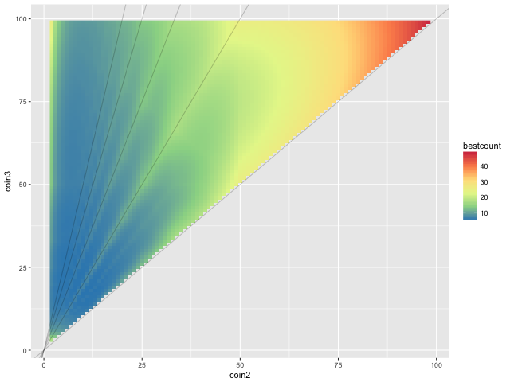

When we overlay lines representing 1:2, 1:3, 1:4 etc. slopes, we find that they fall nicely on top of the suboptimal solutions.

We can explain this qualitatively in terms of factors. For a coinage to be versatile enough to change any number between 1 and 99, the coin values should cover as many prime factors as possible. When one coin value is a simple multiple of another, then there are on average fewer factors available, and the average cost would tend to be higher.

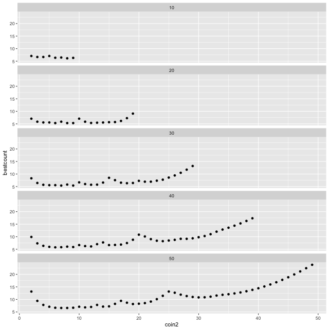

Above are transects through the landscape plot for different values of `coin3`. For `coin3 = 30`, for example, the local peaks representing high-cost solutions occur with denominations `1 10 30`, `1 15 30`, and `1 20 30`.

Solutions close to the 1:1 line are also inefficient. These represent denominations where there are two coins very close in value, e.g. `1 49 50`. The closeness of their value means that they are largely redundant, and so on average the humble 1-cent piece has to do most of the work in making up change.

### Which amounts are harder to make change for?

Now that we've mentioned prime factors, we have a suspicion that when the amount of money to be changed is a prime (e.g. 41 cents), it will be harder to make change for it. Is this true?

The following plot shows the average fewest-coin solution for all 3-coin denominations, as the amount of money to be changed is varied.

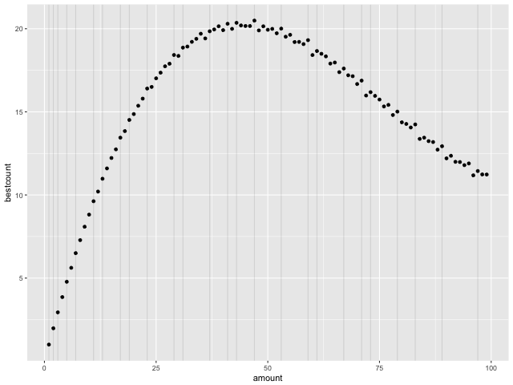

The prime effect is not really noticeable for amounts < 15. Otherwise, there is usually a small uptick in the mean number of coins needed to make change for prime numbers. The effect is not large, but this probably represents the fact that any effect is "averaged out" because we are taking the mean across all possible denominations.

Furthermore, the broader trend peaks around 50. I'm not sure what might be an intuitive explanation for this.

### Number of equally-good solutions

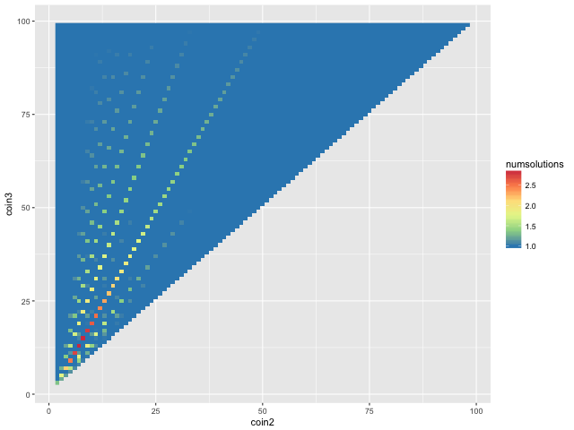

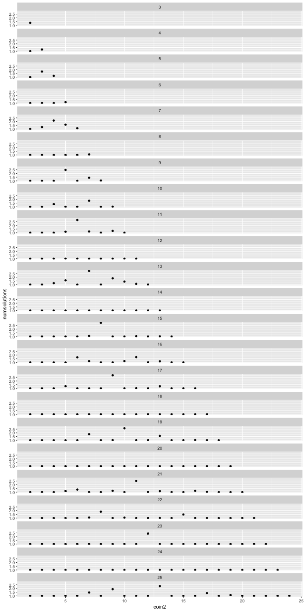

## Real prices - USA

Now that we've thoroughly explored the solution landscape, instead of only picking the optimal solution, let's question the other assumption: that all prices are equally likely.

The following is a histogram of the cents-part of prices from the US supermarker Stop and Shop's website.

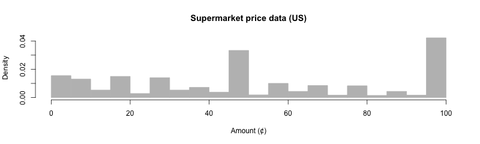

A large fraction of prices end in .99 and .49. This phenomenon is probably familiar to most readers from personal experience. It's thus clear that prices are not all equally weighted, and some amounts more often need to be changed than others.

This was the original motivation for this entire analysis - In an idle moment, I wondered whether it would be worthwhile to mint a 99-cent coin.

Is it?

### Optimal denomination landscape using real-life prices

Surprisingly - no! The optimal denomination is in fact `1 9 49`, when we use the empirical distribution of prices from Stop and Shop. It is a clear winner, just after the runner-up `1 9 30`.

However it is clear how the top two solutions optimize for the commonly encountered 99 and 49.

coin1 | coin2 | coin3 | weighted cost
------|-------|-------|--------------
 1    | 9     | 49    | 4.425469
 1    | 9     | 30    | 4.687068
 1    | 8     | 49    | 4.744324
 1    | 6     | 49    | 4.762093
 1    | 7     | 49    | 4.802567
 1    | 9     | 20    | 4.811451

The solution landscape now looks quite different:

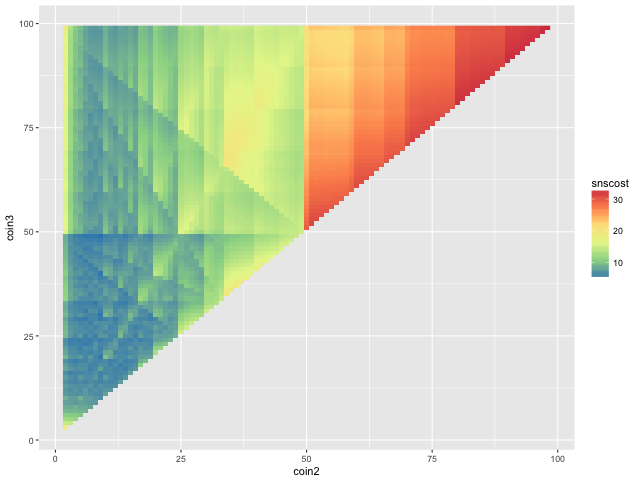

There are some clear messages: the upper right corner (higher coin values) is a bad place to be, and the lower left (smaller values) is somewhat better. However, the criss-crossing pattern of stripes is not so straightforward to explain than the uniform-distribution scenario.

## Customer or cashier?

Up to this point we have been making change for real-life prices. However, this is from the customer's perspective. What about the cashier? Faced with a price of .49, the customer has to figure out how to make change for .49, while the cashier has to make change for 1.00 - .49 = .51.

Indeed, the cashier's dream denomination should be one of the following:

coin1 | coin2 | coin3 | weighted cost
------|-------|-------|--------------
 1    | 10    | 41    | 3.918065
 1    | 10    | 31    | 4.021718
 1    | 9     | 31    | 4.119447
 1    | 10    | 25    | 4.125370
 1    | 19    | 31    | 4.143139
 1    | 10    | 51    | 4.160908

The solution landscape from the cashier's perspective now looks like this:

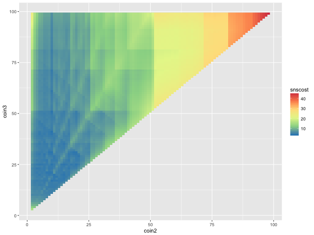

It is actually better to be a cashier, because the mean cost for the top cashier's denomination is almost half a coin less than that for the top customer's denomination.

### What's good for both?

In reality, the same currency will have to be used by both customer and cashier. We can try to compromise by taking the average of the mean cost for customer and mean cost for cashier.

coin1 | coin2 | coin3 | customer | cashier | combined
------|-------|-------|----------|---------|---------
 1 | 9 | 30 | 4.687068 | 4.467917 | 4.577493
 1 | 9 | 20 | 4.811451 | 4.428430 | 4.619941
 1 | 9 | 31 | 5.270484 | 4.119447 | 4.694965
 1 | 9 | 40 | 4.818361 | 4.582428 | 4.700395
 1 | 11 | 19 | 5.343534 | 4.265548 | 4.804541
 1 | 14 | 17 | 5.187562 | 4.517275 | 4.852419

The solution landscape:

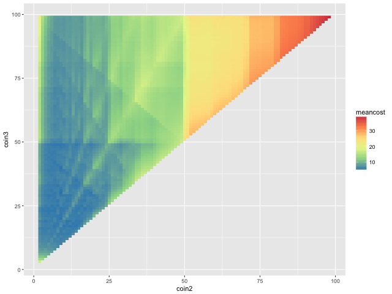

This is the final answer: `1 9 30` is the best 3-coin denomination, given real-life prices! It is probably also easier for mental arithmetic than the `1 12 19` denomination assuming a uniform distribution of prices.

As far as I am aware, no real-life currency uses this denomination. However, the pre-decimal British coinage comes close (`1 3 6 12 24 30 60`), as it is built on a base-12 system.

*Below: Artist's rendering of the new rational denominations*

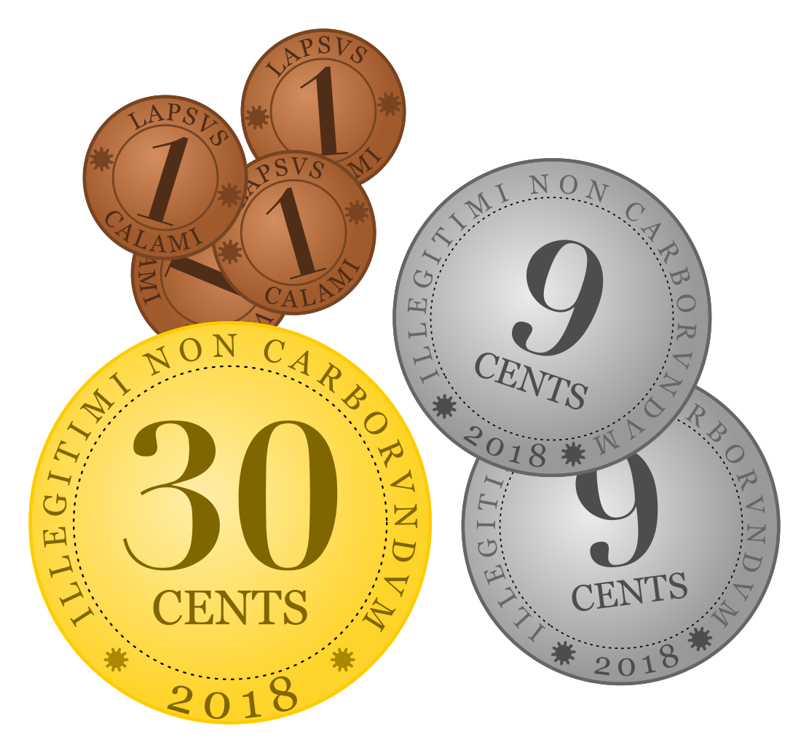
