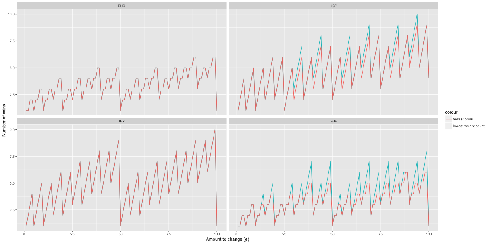
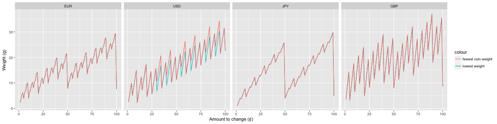

How well do real-life currencies perform in making change?

## The currencies

For this analysis, I have chosen four well-known currencies. Here they are with their sub-base-unit coins (e.g. for USD, everything under $1).

Currency       | Code | Denominations
-------------- | ---- | -------------
US dollar      | USD  | 25, 10, 5, 1
Japanese yen   | JPY  | 100, 50, 10, 5, 1
Euro           | EUR  | 100, 50, 20, 10, 5, 2, 1
Pound sterling | GBP  | 100, 50, 20, 10, 5, 2, 1

There are also 1 USD and 0.50 USD coins in circulation, but they are quite uncommon so they have been left out of this analysis.

## Minimizing number of coins

## Minimizing the weight of coins

## Discrepancies between lowest-count and lowest-weight

## Discrepancies between optimal and greedy minimum-count solutions
