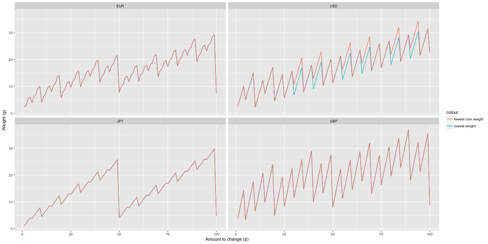
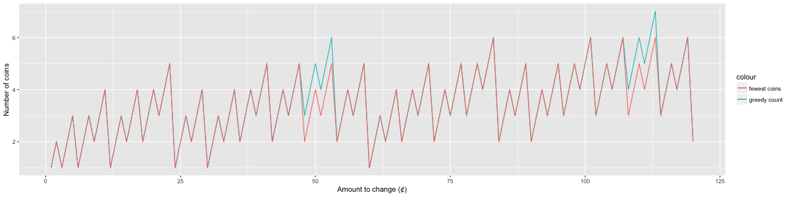

How well do real-life currencies perform in making change?

## The currencies and their denominations

For this analysis, I have chosen four well-known currencies. Here they are with their sub-base-unit coins (e.g. for USD, everything under $1).

Currency       | Code | Denominations
-------------- | ---- | -------------
US dollar      | USD  | 25, 10, 5, 1
Japanese yen   | JPY  | 100, 50, 10, 5, 1
Euro           | EUR  | 100, 50, 20, 10, 5, 2, 1
Pound sterling | GBP  | 100, 50, 20, 10, 5, 2, 1

There are also 1 USD and 0.50 USD coins in circulation, but they are quite uncommon so they have been left out of this analysis.

Both EUR and GBP use the same denominations, which is a series (1, 2, 5) that repeats with every order of ten (the progression carries into banknotes, which are also denominated 10, 20, 50, ... EUR). However the weights of their coins are quite different, so I was curious to see if this had an effect when trying to minimize the change by weight.

## Minimizing number of coins

*Figure 1. Number of coins needed to change amounts from 1 to 99 in four currencies, optimizing for fewest coins*

On average, the EUR and GBP require fewer coins to make change than the USD or JPY. However this is at the expense of having more different denominations, which may make handling and the actual process of counting change slower.

The JPY has bigger "see-saws" in the graph. For example, making change for 49 yen requires 9 coins, but 50 yen is represented by a single coin. This is because although both the JPY and USD both have 4 coins with value below 100 cents/yen, the 25-cent USD piece is a useful intermediate value vs the JPY which immediately jumps from 10 to 50 yen.

Nonetheless, it is easier to handle coins and to mentally count change in JPY (also from personal experience) because there are only two numbers (1, 5) per order of magnitude, and the design of the coins makes them easily differentiable.

## Minimizing the weight of coins

*Figure 2. Total weights of coins needed to change amounts from 1 to 99 in four currencies, optimizing for fewest coins or for lowest total weight.*

*Figure 3. Number of coins needed to change amounts from 1 to 99 in four currencies, optimizing for fewest coins or lowest weight*

For the EUR and JPY, the solution that minimizes the total number of coins also minimizes the total weight of coins. This is a useful property to have. However, this is not the case for the USD.

> Example:
> To change 0.30 GBP, the fewest-coin solution uses 2 coins: `25 5` and has weight 10.67 g
> However to minimize weight, the best solution is `10 10 10`, weighing 6.804 g

For GBP, the 2-pence coin is actually twice the weight of the 1-pence coin, hence there can be two or more equally-good solutions for minimizing the weight. This can be seen by comparing Figures 2 and 3: the lines depicting optimal solutions overlap when plotted by weight, but diverge when plotting by number.

> Example:
> To change 0.49 GBP, the fewest-coin solution uses 5 coins: `20 20 5 2 2`, having a weight of 27.49 g.
> However, the alternative solution `20 20 5 1 1 1 1` has the same total weight.

## Discrepancies between optimal and greedy minimum-count solutions

For the EUR, USD, JPY, and (decimalized) GBP, the fewest-count solution is identical to the solution by the greedy algorithm for all values. However, this is not necessarily the case. It is possible for the greedy algorithm to yield a suboptimal solution for some denominations.

The pre-decimal British coinage (pounds shillings pence, abbreviated £ s d) gives such a result. These were the denominations used in the United Kingdom before 1971. One pound sterling was composed of 20 shillings, and one shilling 12 pence, hence a penny was 1/240 of a pound. After decimalization, the value of the pound was retained, but subdivided into 100 new pence. Hence each shilling was now equivalent to 5 new pence, and the old penny was worth 5/12 of the new.

The values of the pre-decimal British denominations (in pence) were:

Name       | Value
-----------|------
Pence      | 1
Threepence | 3
Sixpence   | 6
Shilling   | 12
Florin     | 24
Half-crown | 30
Crown      | 60

*Figure 4. Number of coins to change amounts from 1 to 120 in pre-decimal British coinage, optimal solution vs. greedy solution*

For some values, e.g. 50 d (four shillings and two pence, written *4/2*), the half-crown coin seems to serve as an "attractor" for the greedy algorithm, leading it to a suboptimal solution, because its value (30 d) is close to that of the next coin (florin, 24 d), but there is a bigger gap between the florin and the next coin (shilling, 12 d).

> Example
> To change 50 pre-decimal pence, the best solution uses 4 coins: `24 24 1 1`
> The greedy algorithm yields a solution with 5 coins: `30 12 6 1 1`

Other coinage such as the guinea (1 pound 1 shilling), sovereign (1 pound), and fractions thereof (e.g. half-guinea, half-sovereign, quarter-guinea), and sub-pence coins such as the ha'penny (1/2 d) or farthing (1/4 d), would have complicated the situation even more, but they were largely obsolete by 1971.

## Weights of coinage

*Figure 5. Weights vs. value for selected currencies (horizontal axis is on a logarithmic scale)*

How rational are different currencies in terms of the weight of their coins? Figure 5 shows a comparison for eight different currencies, including three (AUD, CHF, SGD) that lack a 1-cent piece.

If we consider "rational" to mean that higher values always have higher weights, then only the SGD qualifies. The EUR and JPY come close, for example the 50-cent EUR piece is only slightly heavier (7.8 g) than the 1-euro piece (7.5), and the 10 JPY piece (4.5 g) is only slightly heavier than the 50 JPY piece (4.0 g).

The CHF, GBP, and USD do not show a rational progression of weights, but it is still fairly easy to distinguish the different coins by touch from their size and texture, or visually by color (e.g. the 1- and 10-cent USD pieces). There might be a psychological factor, too. The values for coins below 1 dollar/pound/franc fluctuate between a certain range, and there is a more pronounced jump afterwards.

The pre-decimal British coinage is obsolete, but the heaviness of the 1-crown piece (60 d) is understandable, as it was a rare coin and was of substantial value, at least before inflation.

However the AUD makes no sense at all. Why is the 50-cent AUD piece so heavy? At 15.55 g, it is almost twice as heavy as the 1 AUD coin (9.0 g). It is a mystery to me....
